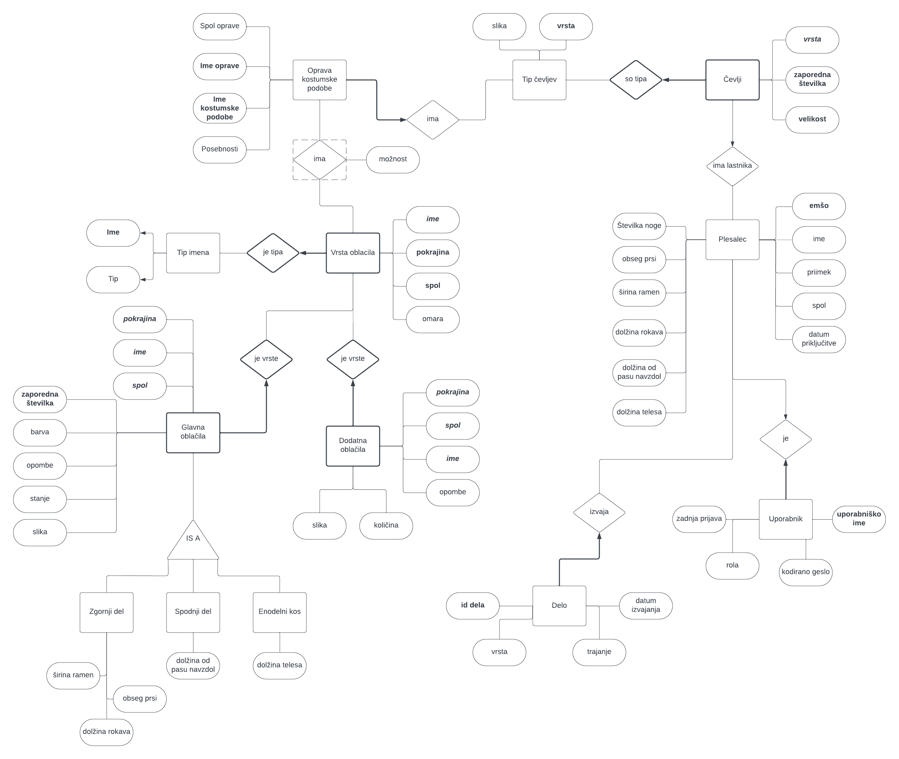

# Organizacija garderobe folklornega društva
Projekt pri predmetu Osnove podatkovnih baz

* [](https://mybinder.org/v2/gh/BarbaraPal/OPB-organizacija-garderobe-folklornega-dru-tva/master?urlpath=proxy%2F8080)
## Opis
Aplikacija je v prvi vrsti namenjena garderoberjem folklornega društva, je pa uporabna tudi za navadne plesalce.

Pogled garderoberjev:
* svoj profil
* aktivni plesalci, dodajanje in brisanje plesalcev, pregled njihovih podatkov in možnost spreminjanja teh podatkov ter možnost dodajanja uporabniških računov plesalcem
* pregled nad vrstami oblačil in kosi oblačil, možnost dodajanja novih kosov, brisanja kosov ali cele vrste oblačil, možnost urejanja že vnešenih kosov
* pregled nad vsemi pari čevljev in njihovimi lastniki, možnost spreminjanja lastništva čevljev, dodajanje čevljev in pregled nad obstoječimi tipi čevljev ter možnost brisanja le teh
* pregled nad opravami kostumskih podob in možnost njihovega urejanja
* dodeljevanje oblačil za nastop: garderober izbere plesalce in kose oblačil, aplikacija pa vrne plesalce z dodeljenimi kosi oblačil, tako da so oblačila plesalcem čibolj prav 
* možnost dodajanja dela za kateregakoli plesalca in pregled statistike dela za posameznega plesalca

Pogled navadnega uporabnika:
* svoj profil
* pregled vseh vrst oblačil in kosov teh oblačil s slikami
* pregled nad vsemi pari čevljev in njihovimi lastniki ter slike tipov čevljev
* pregled nad opravami kostumskih podob
* možnost dodajanja svojega dela in pogled na svojo statistiko dela

## Aplikacija

Aplikacijo zaženemo tako, da poženemo program [`app.py`](app.py), npr.
```bash
python primer.py
```
Za vstop v vsebino aplikacije sta ustvarjena dva uporabniška računa. 
Uporabnik **admin** s funkcijo garderoberja:
* uporabniško ime: admin 
* geslo: novogeslo
Uporabnik **plesalec** kot navaden uporabnik:
* uporabniško ime: plesalec 
* geslo: novogeslo

Aplikacijo je mogoče poganjati tudi na spletu z orodjem [Binder](https://mybinder.org/). 

## ER diagram

